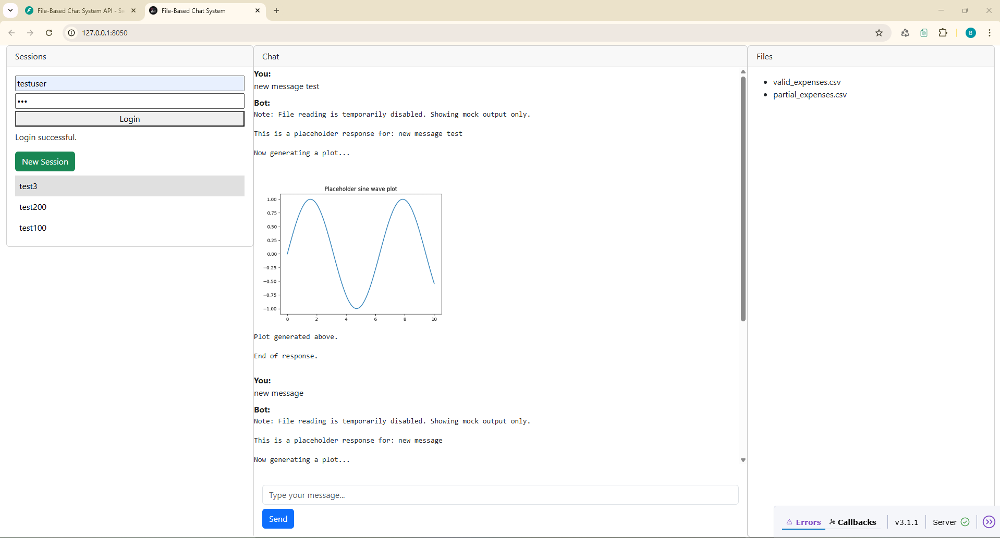

# CT Vibe: Session-Based Chat & File Management System

## Project Overview

CT Vibe is a modern, extensible platform for session-driven chat and file management, built with FastAPI (backend) and Dash (frontend). It is designed for transparency, easy debugging, and rapid prototyping in collaborative or data-driven environments.

### Key Features
- **Session Management:** Create, rename, delete, and list sessions. Each session stores its own files and chat history.
- **File Upload & Preview:** Upload CSV files to new or existing sessions, preview files before submission.
- **Chat System:** Interact with a bot in each session. Chat responses are returned as ordered events (text and plot images) for rich, interactive conversations.
- **Modern UI:** Responsive, clean interface using Dash Bootstrap Components. Sidebar for session/file management, main panel for chat and file preview.
- **Auto-Scroll & UX:** Chat window auto-scrolls to the latest message, input box is fixed at the bottom for seamless interaction.
- **File-Based Storage:** All data is stored in the filesystem for transparency and easy debugging. No database required.

### How It Works
- The backend (FastAPI) exposes REST endpoints for session, file, and chat management. All operations are performed for a hardcoded user (`testuser`) for simplicity.
- The frontend (Dash) provides a sidebar for session/file management and a main chat window. All actions are handled via Dash callbacks and HTTP requests to the backend.
- Chat responses from the backend `/query` endpoint are returned as an ordered list of output events (text and plot), which the frontend renders in sequence.

### Demo Screenshot
The image above shows:
- **Sidebar:** User login, session list, new session creation, and session selection.
- **Main Panel:** Chat window with user and bot messages, including a generated plot. Chat input box is fixed at the bottom.
- **Files Panel:** List of uploaded files for the selected session.

### Who Is This For?
- Developers and data scientists who want a transparent, file-based chat/file management system for prototyping, collaboration, or teaching.
- Anyone interested in building modern, session-driven UIs with Python, Dash, and FastAPI.

---
See the `backend/README.md` and `frontend/README.md` for detailed API and UI documentation.
